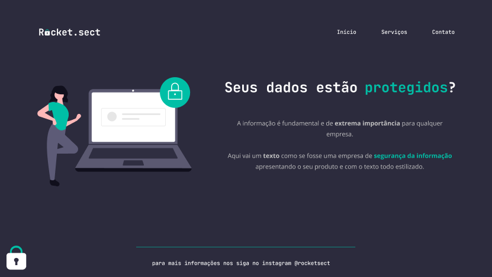

<h1 align="center">Rocket.sect</h1>

Projeto extra para reforçar os conceitos aprendidos durante o desenvolvimento do projeto 02 (Treine.me) da formação Explorer na Rocketseat!

  <a href="#-tecnologias">Tecnologias</a>&nbsp;&nbsp;&nbsp;|&nbsp;&nbsp;&nbsp;
  <a href="#-conceitos">Conceitos</a>&nbsp;&nbsp;&nbsp;|&nbsp;&nbsp;&nbsp;
  <a href="#-layout">Layout</a>&nbsp;&nbsp;&nbsp;|&nbsp;&nbsp;&nbsp;
  <a href="#-licença">Licença</a>

 

  

## 🚀 Tecnologias

Esse projeto utiliza as seguintes tecnologias:

* *HTML e CSS*
* *Git e GitHub*

## 📑 Conceitos

Estes foram alguns assuntos abordados durante o desenvolvimento do projeto:

* *HTML Semântico, Estrutura do projeto, Box Model*
* *DevTools, Flexbox, Acessibilidade, Refatoração*
* *dentre outros...*

## 📐 Layout

Você pode visualizar o layout do projeto através [*desse link*](https://www.figma.com/file/EdKjPWjC8ZlbnH4XzTObv2/Explorer/duplicate?node-id=0%3A1). É necessário ter conta no [*Figma*](https://figma.com) para acessá-lo.

## ✒️ Licença

Esse projeto está sob a licença MIT.

---

*Feito com* 💜 *por* [*Carlos André.*](https://github.com/andresoftdev)